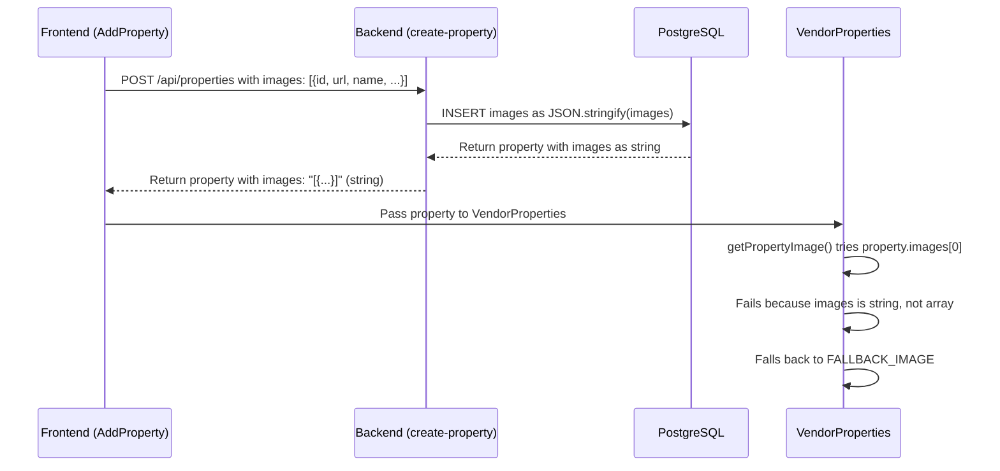

# Design Document: Vendor Property Image Thumbnails Fix

## Overview

This document outlines the fix for the vendor property image thumbnail display issue. The problem has three layers:

1. **Primary**: No `/upload` API endpoint exists, causing file uploads to fail silently
2. **Secondary**: Data serialization mismatch where backend stores images as JSON string but frontend expects array
3. **Tertiary**: Frontend filtering removes fallback URLs, preventing any images from being saved

The fix involves:
1. Creating a `/upload` endpoint with persistent storage
2. Fixing data serialization in backend handlers
3. Adding defensive parsing in frontend display logic

## Current Data Flow



## Root Cause

The `getPropertyImage()` function in VendorProperties.js:

```javascript
const getPropertyImage = (property = {}) => {
  if (property.thumbnailUrl) return property.thumbnailUrl;
  if (property.coverImage) return property.coverImage;
  if (property.image) return property.image;

  const firstImage = property.images?.[0] || property.gallery?.[0];
  if (typeof firstImage === 'string') return firstImage;
  if (firstImage?.url) return firstImage.url;
  if (firstImage?.src) return firstImage.src;

  return FALLBACK_IMAGE;
};
```

When `property.images` is a JSON string like `"[{\"id\":123,\"url\":\"...\"}]"`, the optional chaining `property.images?.[0]` returns the first character `"["` instead of the first object.

## Solution: Backend Fix

### Backend Changes

**File**: `api/properties/handlers/create-property.js`

When returning the property from the database, parse the `images` JSON string back to an array:

```javascript
// After fetching from database
const property = result.rows[0];

// Parse JSON fields
if (property.images && typeof property.images === 'string') {
  try {
    property.images = JSON.parse(property.images);
  } catch (e) {
    property.images = [];
  }
}

if (property.amenities && typeof property.amenities === 'string') {
  try {
    property.amenities = JSON.parse(property.amenities);
  } catch (e) {
    property.amenities = [];
  }
}

return res.status(201).json({
  success: true,
  message: 'Property created successfully',
  data: property
});
```

**File**: `api/properties/handlers/update-property.js`

Apply the same parsing logic when returning updated properties.

### Frontend Enhancement (Defensive)

**File**: `src/components/vendor/VendorProperties.js`

Update `getPropertyImage()` to handle both formats as a defensive measure:

```javascript
const getPropertyImage = (property = {}) => {
  if (property.thumbnailUrl) return property.thumbnailUrl;
  if (property.coverImage) return property.coverImage;
  if (property.image) return property.image;

  // Handle images - could be array or JSON string
  let images = property.images;
  if (typeof images === 'string') {
    try {
      images = JSON.parse(images);
    } catch (e) {
      images = [];
    }
  }

  const firstImage = images?.[0] || property.gallery?.[0];
  if (typeof firstImage === 'string') return firstImage;
  if (firstImage?.url) return firstImage.url;
  if (firstImage?.src) return firstImage.src;

  return FALLBACK_IMAGE;
};
```

## Data Format Specification

### Image Object Structure

```javascript
{
  id: number | string,           // Unique identifier
  url: string,                   // Image URL (http/https)
  name: string,                  // Original filename
  size: number,                  // File size in bytes
  path: string | null,           // Storage path (if applicable)
  isUploaded: boolean            // Upload status flag
}
```

### Property Images Field

**In Frontend (formData)**:
```javascript
images: Array<ImageObject>
```

**In Backend (Database)**:
```javascript
images: string (JSON stringified)
```

**In Backend (Response)**:
```javascript
images: Array<ImageObject> (parsed from JSON string)
```

## Implementation Steps

1. **Backend**: Update `create-property.js` to parse JSON fields before returning
2. **Backend**: Update `update-property.js` to parse JSON fields before returning
3. **Frontend**: Update `getPropertyImage()` to handle both string and array formats
4. **Testing**: Verify images display correctly after creation and page refresh
5. **Testing**: Verify multiple images work correctly
6. **Testing**: Verify URL-based images work correctly

## Error Handling

- If JSON parsing fails, default to empty array
- If images array is empty, use fallback image
- Log parsing errors for debugging (non-blocking)

## Correctness Properties

1. **Image Persistence**: Images uploaded with a property persist after page refresh
2. **First Image Display**: The first image in the array always displays as thumbnail
3. **Format Consistency**: Images are always returned as an array from the backend
4. **Defensive Parsing**: Frontend can handle both string and array formats
5. **Fallback Behavior**: Fallback image displays only when no images are available
6. **No Data Loss**: Image data is preserved through the entire save/retrieve cycle

## Testing Strategy

### Unit Tests

Test `getPropertyImage()` with various input formats:
- Property with images as array
- Property with images as JSON string
- Property with images as empty array
- Property with images as null/undefined
- Property with malformed JSON string
- Property with thumbnailUrl (should take precedence)

### Integration Tests

- Create property with file uploads → verify thumbnail displays
- Create property with URL inputs → verify thumbnail displays
- Edit property and add more images → verify first image still displays
- Refresh page → verify images persist
- Delete property → verify cleanup

### Manual Testing

- Create property with 1 image → verify displays
- Create property with 5 images → verify first displays
- Create property with mixed file and URL images → verify first displays
- Edit property to add more images → verify first still displays
